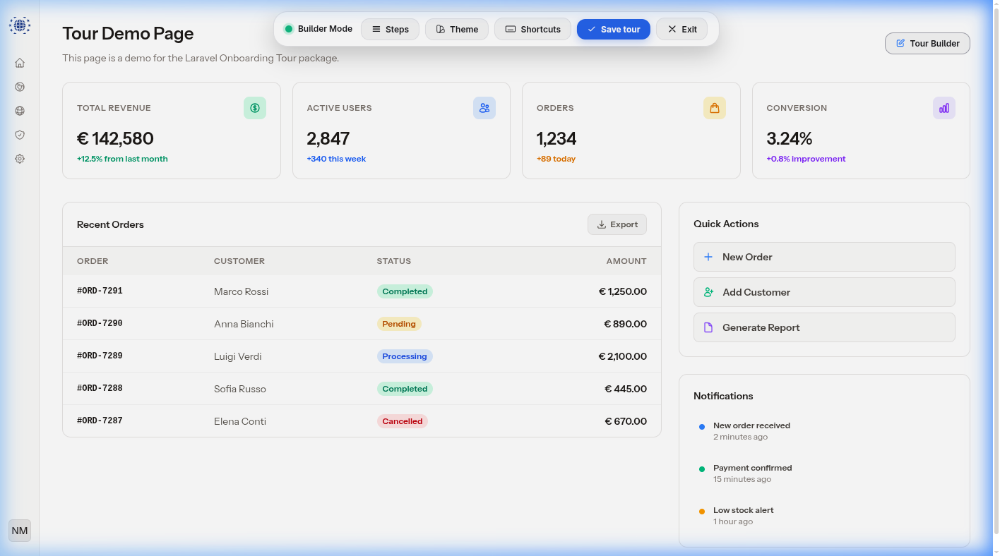
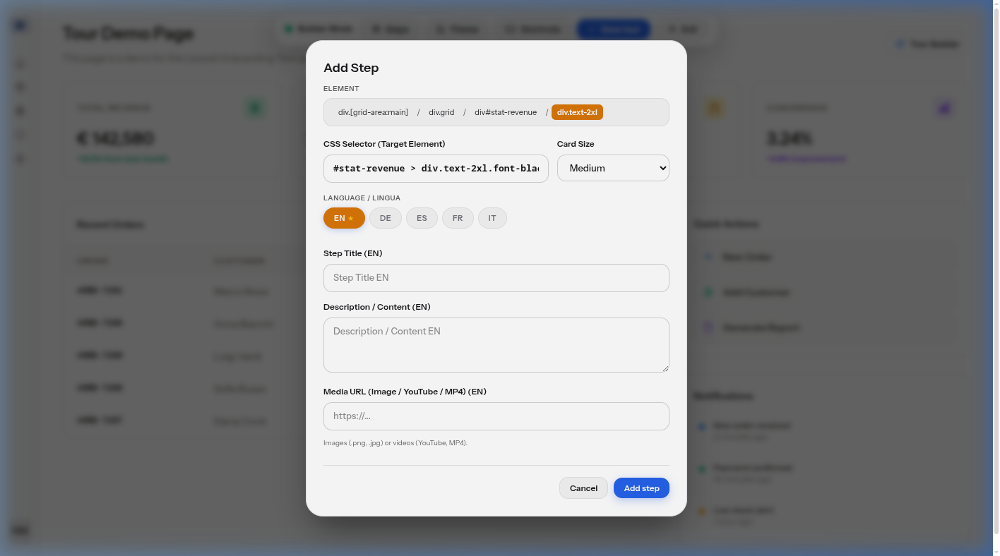
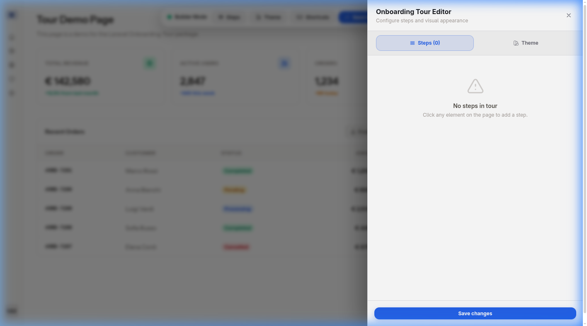
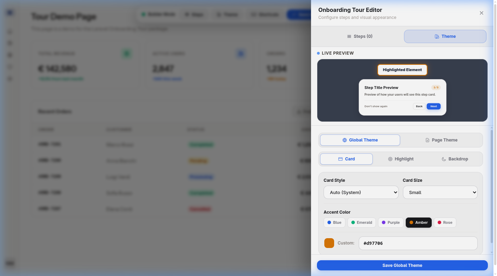
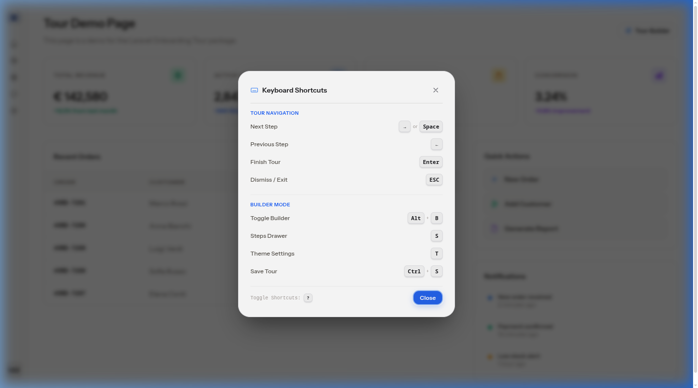

# Laravel Onboarding Tour

[](https://packagist.org/packages/taoshan98/laravel-onboarding-tour)
[](https://packagist.org/packages/taoshan98/laravel-onboarding-tour)
[](LICENSE)

An interactive onboarding tour package for Laravel. Build guided tours visually in the browser — no code required. Features a live visual builder, multi-language support, theme customization, keyboard navigation, media lightbox, and Livewire v3 SPA compatibility.

**Zero JS/CSS dependencies.** Works on any Laravel app with or without Tailwind, Bootstrap, or Flux.

---

## Features

- **Visual Builder** — Click any element on your page to create tour steps. Drag & drop to reorder. Live preview.
- **Multi-Language (i18n)** — Auto-discovers host locales from `lang/` directories and config. Per-step titles, descriptions, and media URLs for each language.
- **Theme Customization** — Global and per-tour themes. Card styles (auto, glass, dark, light), accent colors, backdrop presets, highlight styles, live preview.
- **Keyboard Shortcuts** — Full hotkey navigation with an interactive shortcuts palette (`?`).
- **Media Lightbox** — Expandable full-screen viewer for images, GIFs, YouTube, Vimeo, and MP4 videos.
- **Dark Mode** — Automatically follows your host app's theme (`.dark` class or `[data-theme="dark"]`).
- **Livewire v3** — Seamless re-init on `wire:navigate` page swaps.
- **Cache Optimized** — Tour data cached with configurable TTL. Auto-invalidation on theme/tour changes.
- **Secure** — HTTPS enforcement, XSS protection, dangerous scheme filtering on all URLs.

---

## Screenshots

### Demo


### Visual Builder Mode
Click the **Builder** button to enter inspector mode. A floating toolbar appears at the top with quick actions.



### Step Configuration Modal
Click any element to configure a tour step. The default language (`EN ★`) is shown first, with tabs for all discovered locales.



### Steps Manager Drawer
Manage all steps in a side drawer. Drag to reorder, edit, delete, or preview individual steps.



### Theme Customization
Customize card style, accent color, highlight effect, and backdrop with a live preview.



### Keyboard Shortcuts Palette
Press `?` to open the interactive shortcuts reference.



---

## Requirements

- PHP >= 8.2
- Laravel 10, 11, or 12

---

## Installation

```bash
composer require taoshan98/laravel-onboarding-tour
php artisan migrate
```

Optionally publish configuration and translations:

```bash
php artisan vendor:publish --tag="onboarding-tour-config"
php artisan vendor:publish --tag="onboarding-tour-lang"
```

Other publishable assets:

```bash
# Blade views (for customization)
php artisan vendor:publish --tag="onboarding-tour-views"

# JS/CSS assets (to serve from public/ instead of inline)
php artisan vendor:publish --tag="onboarding-tour-assets"
```

---

## Usage

### 1. Add the component to your layout

Place `<x-onboarding-tour />` in your main layout file (e.g. `resources/views/layouts/app.blade.php`):

```blade
<body>
    {{ $slot }}

    <!-- Onboarding Tour Engine -->
    <x-onboarding-tour />
</body>
```

This injects the CSS, JS, and tour trigger/admin buttons automatically.

### 2. Place trigger buttons in your navigation

```blade
<!-- Tour start button (visible when a tour exists for the current route) -->
<x-onboarding-tour-trigger />

<!-- Admin builder toggle (protect with your own authorization) -->
@can('manage-tours')
    <x-onboarding-tour-admin-toggle />
@endcan
```

### 3. Build a tour

1. Click the **Builder** button (or press `B`) to enter inspector mode
2. Click any element on the page to select it as a step target
3. Fill in the title, description, and optional media URL for each language
4. Click **Add Step** — repeat for all steps
5. Press `Ctrl+S` (or `Cmd+S`) or click **Save Tour** to persist

The tour is saved via the REST API and cached automatically.

---

## Multi-Language (i18n)

The package automatically discovers all locales available in your host application:

1. **Explicit config** — `config('onboarding-tour.locales')` (highest priority)
2. **Host app config** — `config('app.locales')`, `config('app.available_locales')`, or `config('app.supported_locales')`
3. **Filesystem scan** — Subdirectories and `.json` files in your `lang/` folder
4. **Always included** — `app()->getLocale()` and `config('app.fallback_locale')`

### Default language indicator

The language configured in `config('app.locale')` (your `config/app.php` default) is shown **first** in the builder modal with a **★** badge. If an admin fills in content only for the default language, that content is used as fallback for all other languages.

### Setting locales explicitly

```php
// config/onboarding-tour.php
'locales' => ['en', 'it', 'de', 'fr'], // null = auto-discover
```

---

## Keyboard Shortcuts

Press `?` to open the interactive shortcuts palette.

| Key | Action | Context |
|---|---|---|
| `→` / `L` / `Space` | Next step | Active tour |
| `←` / `H` | Previous step | Active tour |
| `Enter` | Finish tour | Active tour |
| `ESC` | Dismiss / Close | Tour, modal, drawer |
| `?` / `Shift+/` | Toggle shortcuts palette | Global |
| `B` | Toggle builder mode | Admin |
| `S` | Open steps drawer | Builder mode |
| `T` | Open theme drawer | Builder mode |
| `Ctrl+S` / `Cmd+S` | Save tour | Builder mode |

All interactive elements support **Tab / Shift+Tab** focus trapping and ARIA attributes for accessibility.

---

## Theme Customization

Themes are managed entirely through the **admin UI** — no config files needed. The global theme is persisted to the database and cached for performance. Per-tour overrides are also supported.

### Card styles

| Style | Description |
|---|---|
| `auto` | Follows host app theme (light/dark) |
| `glass` | Glassmorphism with backdrop blur |
| `dark` | Always dark card |
| `light` | Always light card |

### Highlight styles

| Style | Description |
|---|---|
| `minimal` | Thin border with subtle shadow |
| `ring` | Border with outer ring |
| `glow` | Pulsing glow effect |
| `dashed` | Dashed border with tinted background |
| `none` | No highlight border |

### Backdrop presets

| Preset | Color |
|---|---|
| 🌌 Midnight Slate | `#0f172a` |
| 🔮 Deep Indigo | `#1e1b4b` |
| 🌲 Emerald Night | `#022c22` |
| 🌪️ Soft Charcoal | `#334155` |

Opacity is adjustable from 20% to 95% via the live preview slider.

---

## Configuration

```php
// config/onboarding-tour.php

return [
    // Master switch
    'enabled' => env('ONBOARDING_TOUR_ENABLED', true),

    // API routes
    'route_prefix' => 'api/onboarding-tour',
    'middleware'    => ['web', 'auth'],

    // Locales: null = auto-discover from host app
    'locales' => null,

    // Cache
    'cache_ttl'    => 86400,              // 24 hours (seconds)
    'cache_prefix' => 'onboarding_tour:', // Redis key prefix
];
```

> **Note:** Theme settings are not in the config file — they are managed through the admin UI and persisted to the database automatically.

---

## REST API

All endpoints use the configured `route_prefix` and `middleware`.

| Method | Endpoint | Description |
|---|---|---|
| `GET` | `/config?route_name={route}` | Get tour data, theme, translations, and locales for a route |
| `POST` | `/save` | Create or update a tour with steps |
| `POST` | `/save-global-theme` | Update the global theme settings |
| `POST` | `/complete` | Mark a tour as completed or dismissed for the current user |
| `POST` | `/delete` | Delete a tour by route name |

---

## How It Works

### Architecture

```
┌─────────────────────────────────────────────┐
│  Blade Component: <x-onboarding-tour />     │
│  Inlines CSS + JS + config JSON             │
└──────────────────┬──────────────────────────┘
                   │
      ┌────────────▼────────────┐
      │   tour-engine.js        │
      │   (Vanilla JS, IIFE)   │
      │                         │
      │  • Tour runner          │
      │  • Visual builder       │
      │  • Theme editor         │
      │  • Keyboard shortcuts   │
      │  • Media lightbox       │
      └────────────┬────────────┘
                   │ fetch()
      ┌────────────▼────────────┐
      │  TourApiController      │
      │  (REST API)             │
      └────────────┬────────────┘
                   │
      ┌────────────▼────────────┐
      │  TourCacheService       │
      │  • Cache layer          │
      │  • Locale discovery     │
      │  • Translation resolver │
      └────────────┬────────────┘
                   │
      ┌────────────▼────────────┐
      │  Eloquent Models        │
      │  • OnboardingTour       │
      │  • OnboardingTourStep   │
      │  • OnboardingTourUser   │
      └─────────────────────────┘
```

### Tour lifecycle

1. `<x-onboarding-tour />` loads cached tour data for the current route
2. If a tour exists and the user hasn't completed/dismissed it, the **Start Tour** button appears
3. User clicks start (or tour auto-starts) → spotlight overlay + popover card
4. User navigates steps with buttons or keyboard
5. On finish/dismiss → `POST /complete` marks the user's status
6. Admin builder saves/updates tours via `POST /save`

### Caching

- Tour data is cached per-route with the configured TTL
- Global theme is persisted to the database and cached forever
- If the cache is cleared, theme data is automatically rebuilt from the database
- Saving a tour automatically flushes the route's cache
- Updating the global theme flushes all route caches

---

## Customizing Views

Publish and edit the Blade templates:

```bash
php artisan vendor:publish --tag="onboarding-tour-views"
```

This copies the views to `resources/views/vendor/onboarding-tour/` where you can customize:

- `components/tour-runner.blade.php` — Main component (CSS/JS injection)
- `components/tour-trigger.blade.php` — Start tour button
- `components/tour-admin-toggle.blade.php` — Admin builder toggle button

---

## Customizing Translations

Publish and edit translation files:

```bash
php artisan vendor:publish --tag="onboarding-tour-lang"
```

Available languages: `en`, `it`. Add more by creating new files in `lang/vendor/onboarding-tour/{locale}/messages.php`.

---

## Security

- All media URLs are sanitized: only `https://`, relative paths (`/`), and `data:image/` are allowed
- `http://` URLs are automatically upgraded to `https://`
- Dangerous schemes (`javascript:`, `data:text/html`, etc.) are blocked
- External links use `rel="noopener noreferrer"` protection

If you discover a security vulnerability, please email info@taoshan.dev directly.

---

## License

The MIT License (MIT). See [LICENSE](LICENSE) for details.
