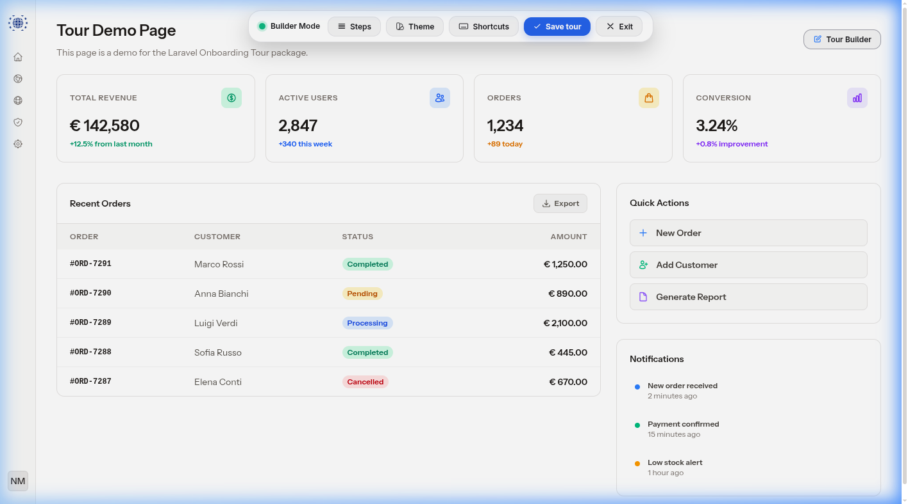
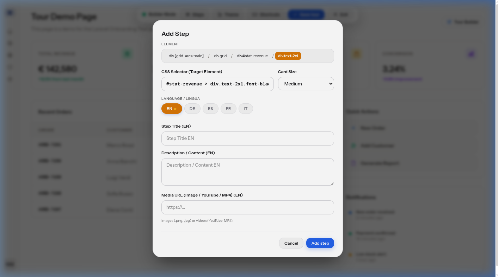
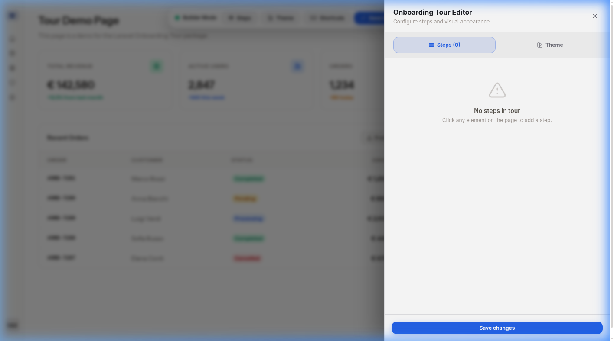
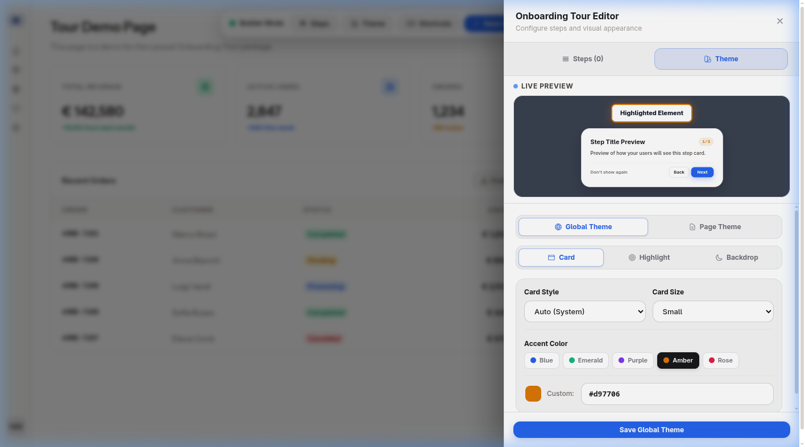
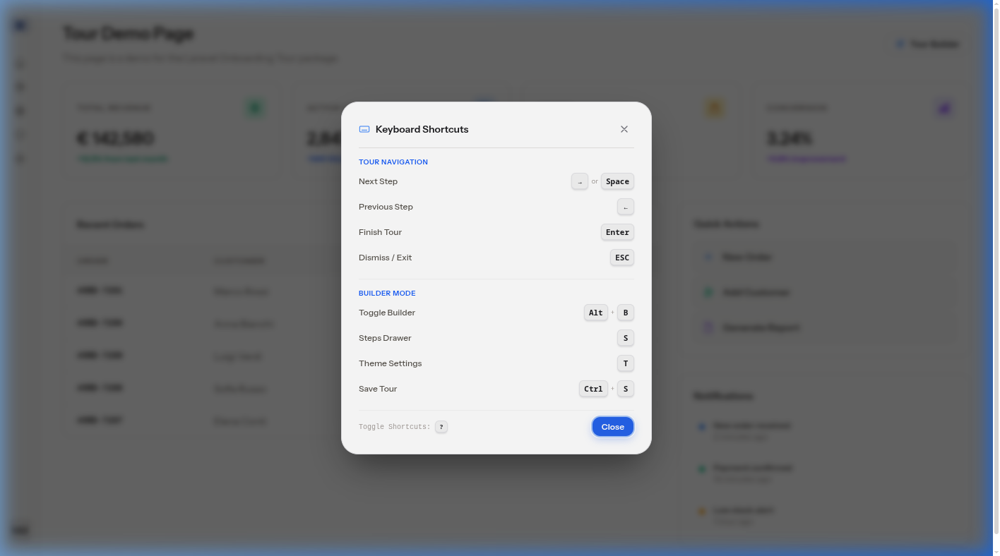

# Laravel Onboarding Tour

[](https://packagist.org/packages/taoshan98/laravel-onboarding-tour)
[](https://packagist.org/packages/taoshan98/laravel-onboarding-tour)
[](LICENSE)

An interactive onboarding tour package for Laravel. Build guided tours visually in the browser — no code required. Features a live visual builder, tour cloning & cross-page import, multi-language support, theme customization, auto-navigation action steps, interactive UI navigation mode, wildcard route matching, keyboard navigation, media lightbox, high-performance Redis caching, and Livewire v3 SPA compatibility.

**Zero JS/CSS dependencies.** Works on any Laravel app with or without Tailwind, Bootstrap, or Flux.

---

## Features

- **Visual Builder** — Click any element on your page to create tour steps. Drag & drop to reorder. Live preview.
- **Tour Cloning & Import** — Easily copy and import tours from other routes (e.g., from `/edit` to `/create`) directly from the Steps Drawer with deduplicated titles and high-contrast page indicators.
- **Auto Navigation Steps** — Create silent action steps that automatically click tabs, steppers, or buttons to navigate interfaces without showing cards.
- **Interactive UI Mode** — Temporarily suspend inspector DOM selection to click sub-tabs, dropdowns, and navigate UI while staying inside the builder.
- **Wildcard Route Matching** — Match dynamic routes easily (e.g. `users/*/edit`) with a default one-click toggle ("Applica a pagine simili") that automatically strips numeric IDs/UUIDs and host domains.
- **Redis & Zero-SQL Backend Caching** — High-performance caching layer with Redis store support, Redis Cache Tags, cached user progress maps (0 SQL queries on page views for authenticated users), and Eloquent model observers to prevent DB-cache desync.
- **Instant FOUC-Free Styling** — Blade `@once` CSS injection ensures tour buttons render fully styled from the first millisecond of page load.
- **Modular & Minified Assets** — Clean modular CSS (`resources/css/modules/`) and JS (`resources/js/modules/`) with automated build script (`composer build-assets`) that generates production-minified bundles.
- **Form Submission Guard** — Advanced programmatic click protection (`safeClick`) that intercepts native `form.submit()` and event dispatches to prevent unintended page reloads during tour playback.
- **Async UI Resilience** — Extended polling resilience (up to 1.5s) for slow Livewire v3, Alpine.js, or AJAX network requests to render DOM nodes.
- **Multi-Language (i18n)** — Auto-discovers host locales from `lang/` directories and config. Per-step titles, descriptions, and media URLs for each language.
- **Theme Customization** — Global and per-tour themes. Card styles (auto, glass, dark, light), accent colors, backdrop presets, highlight styles, live preview.
- **Clean Enterprise Aesthetics** — 100% SVG vector icon set, zero emojis, compact modal layout with accordion for advanced options.
- **Keyboard Shortcuts** — Full hotkey navigation with an interactive shortcuts palette (`?`).
- **Media Lightbox** — Expandable full-screen viewer for images, GIFs, YouTube, Vimeo, and MP4 videos.
- **Dark Mode** — Automatically follows your host app's theme (`.dark` class or `[data-theme="dark"]`).
- **Livewire v3** — Seamless re-init on `wire:navigate` page swaps.
- **Secure** — HTTPS enforcement, XSS protection, dangerous scheme filtering on all URLs.

---

## Screenshots

### Demo


### Visual Builder Mode
Click the **Builder** button to enter inspector mode. A floating toolbar appears at the top with quick actions including **Interactive UI Mode** and **Steps Drawer**.



### Compact Step Builder Modal
Configure tour steps easily with a segmented toggle between **Explanation Card** and **Auto Navigation**. Advanced options (CSS selector, breadcrumbs, card size, media URL) are neatly folded inside an accordion.



### Steps Manager Drawer & Tour Importing
Manage steps in a side drawer, toggle wildcard matching ("Applica a pagine simili"), drag to reorder, edit, test steps, or click **Importa Tour** to clone steps from another route.



### Theme Customization
Customize card style, accent color, highlight effect, and backdrop with a live preview.



### Keyboard Shortcuts Palette
Press `?` to open the interactive shortcuts reference.



---

## Requirements

- PHP >= 8.2
- Laravel 10, 11, or 12

---

## Installation

```bash
composer require taoshan98/laravel-onboarding-tour
php artisan migrate
```

Optionally publish configuration and translations:

```bash
php artisan vendor:publish --tag="onboarding-tour-config"
php artisan vendor:publish --tag="onboarding-tour-lang"
```

Other publishable assets:

```bash
# Blade views (for customization)
php artisan vendor:publish --tag="onboarding-tour-views"

# JS/CSS assets (to serve from public/ instead of inline)
php artisan vendor:publish --tag="onboarding-tour-assets"
```

---

## Usage

### 1. Add the component to your layout

Place `<x-onboarding-tour />` in your main layout file (e.g. `resources/views/layouts/app.blade.php`):

```blade
<body>
    {{ $slot }}

    <!-- Onboarding Tour Engine -->
    <x-onboarding-tour />
</body>
```

This injects the CSS, JS, and runtime configuration invisibly (headless).

### 2. Place trigger buttons in your navigation

```blade
<!-- Tour start button (visible when a tour exists for the current route) -->
<x-onboarding-tour-trigger />

<!-- Admin builder toggle (protect with your own authorization) -->
@can('manage-tours')
    <x-onboarding-tour-builder-toggle />
@endcan
```

### 3. Build or import a tour

1. Click the **Importa Tour** button (or press `B`) to enter inspector mode.
2. If you want to reuse steps from a similar route (e.g. `/edit` to `/create`), click **Importa Tour** in the Steps Drawer and choose an existing tour.
3. If you need to switch tabs or open dropdowns before selecting an element, click **Navigazione UI** (Interactive Mode).
4. Click any element on the page to select it as a step target.
5. Choose the step mode:
   - **Card Spiegazione**: Shows a card with title, description, and optional media.
   - **Navigazione Automatica**: Silently clicks the target element to navigate UI and immediately moves to the next step.
6. Click **Add Step** — repeat for all steps.
7. Press `Ctrl+S` (or `Cmd+S`) or click **Save Tour** to persist.

The tour is saved via the REST API and cached in Redis automatically.

---

## Key Features Breakdown

### Tour Cloning & Importing
You can copy and import tours across different routes with one click. In the Steps Drawer, click **Importa Tour** to see a modal listing available tours with step counts and route patterns. Hardcoded domain names and numeric IDs are automatically normalized to wildcards (`production_sites/*/edit`), and duplicate titles are cleaned up automatically.

### Auto Navigation (Action Steps)
Action steps execute a programmatic click on the targeted element (e.g. tab buttons, wizard step numbers) without displaying a card overlay. This allows seamless transitions across sub-interfaces before displaying subsequent explanation cards.

### Form Submission & Reload Guard
The engine includes a `safeClick` mechanism with `HTMLFormElement.prototype.submit` interception. Programmatic clicks executed by the tour runner are guarded so that buttons inside `<form>` elements or custom event handlers (like `@save-section`) do not trigger unintended page reloads or form submissions.

### Wildcard Route Matching
Wildcard matching ("Applica a pagine simili") is enabled by default to match dynamic routes (e.g., `/users/1/edit` matching `users/*/edit`). Numeric IDs, UUIDs, and host URLs are stripped automatically.

---

## High-Performance Caching & Redis

The package includes a dedicated caching architecture designed for high-traffic enterprise applications:

- **Zero-SQL Page Views**: User completion/dismissal status is cached in a Redis user status map (`{$prefix}user_status:{userType}:{userId}`). Requests from authenticated users incur **0 SQL queries** during page rendering.
- **Redis Cache Tags**: Supports Redis tags (`Cache::tags(['onboarding_tour'])`) for instant bulk cache flushing.
- **Eloquent Model Observers**: `OnboardingTour` and `OnboardingTourStep` models automatically trigger cache invalidation on `saved` and `deleted` events, preventing database-cache desynchronization even when modifying records outside the API (e.g. via Tinker or Seeders).
- **Dedicated Store Config**: Route package caching to a specific cache store via `ONBOARDING_TOUR_CACHE_STORE=redis`.

---

## Asset Development & Bundling

The frontend codebase is organized into modular source files:

- **CSS Modules**: `resources/css/modules/*.css` (base, buttons, inspector, drawer, modals, popovers)
- **JS Modules**: `resources/js/modules/*.js` (utils, theme, builder, drawer, runner, main)

When modifying frontend code, run the asset bundler script:

```bash
composer build-assets
# or
php scripts/build-assets.php
```

This concatenates and minifies the source modules into standalone production bundles (`resources/css/tour-styles.css` & `resources/js/tour-engine.js`).

---

## Multi-Language (i18n)

The package automatically discovers all locales available in your host application:

1. **Explicit config** — `config('onboarding-tour.locales')` (highest priority)
2. **Host app config** — `config('app.locales')`, `config('app.available_locales')`, or `config('app.supported_locales')`
3. **Filesystem scan** — Subdirectories and `.json` files in your `lang/` folder
4. **Always included** — `app()->getLocale()` and `config('app.fallback_locale')`

---

## Keyboard Shortcuts

Press `?` to open the interactive shortcuts palette.

| Key | Action | Context |
|---|---|---|
| `→` / `L` / `Space` | Next step | Active tour |
| `←` / `H` | Previous step | Active tour |
| `Enter` | Finish tour | Active tour |
| `ESC` | Dismiss / Close | Tour, modal, drawer |
| `?` / `Shift+/` | Toggle shortcuts palette | Global |
| `B` | Toggle builder mode | Admin |
| `S` | Open steps drawer | Builder mode |
| `T` | Open theme drawer | Builder mode |
| `Ctrl+S` / `Cmd+S` | Save tour | Builder mode |

---

## Theme Customization

Themes are managed entirely through the **admin UI** — no config files needed. The global theme is persisted to the database and cached for performance. Per-tour overrides are also supported.

### Card styles

| Style | Description |
|---|---|
| `auto` | Follows host app theme (light/dark) |
| `glass` | Glassmorphism with backdrop blur |
| `dark` | Always dark card |
| `light` | Always light card |

### Highlight styles

| Style | Description |
|---|---|
| `minimal` | Thin border with subtle shadow |
| `ring` | Border with outer ring |
| `glow` | Pulsing glow effect |
| `dashed` | Dashed border with tinted background |
| `none` | No highlight border |

---

## Configuration

```php
// config/onboarding-tour.php

return [
    // Master switch
    'enabled' => env('ONBOARDING_TOUR_ENABLED', true),

    // API routes
    'route_prefix' => 'api/onboarding-tour',
    'middleware'   => ['web', 'auth'],

    // Locales: null = auto-discover from host app
    'locales' => null,

    // Cache & Redis Settings
    'cache_store'    => env('ONBOARDING_TOUR_CACHE_STORE', null),  // e.g. 'redis'
    'use_cache_tags' => env('ONBOARDING_TOUR_CACHE_TAGS', true),  // Enable Redis Cache Tags
    'cache_ttl'      => env('ONBOARDING_TOUR_CACHE_TTL', 86400),  // 24 hours (seconds)
    'cache_prefix'   => env('ONBOARDING_TOUR_CACHE_PREFIX', 'onboarding_tour:'),
];
```

---

## REST API

All endpoints use the configured `route_prefix` and `middleware`.

| Method | Endpoint | Description |
|---|---|---|
| `GET` | `/config?route_name={route}` | Get tour data, theme, translations, and locales for a route |
| `GET` | `/list` | Get list of all active tours with step counts for cloning/importing |
| `POST` | `/save` | Create or update a tour with steps |
| `POST` | `/save-global-theme` | Update the global theme settings |
| `POST` | `/complete` | Mark a tour as completed or dismissed for current user |
| `POST` | `/delete` | Delete a tour by route name |

---

## Customizing Views & Assets

Publish and edit Blade templates:

```bash
php artisan vendor:publish --tag="onboarding-tour-views"
```

This copies views to `resources/views/vendor/onboarding-tour/`:

- `components/tour-runner.blade.php` — Main component (inlines CSS/JS with `@once`)
- `components/tour-trigger.blade.php` — Start tour button
- `components/tour-builder-toggle.blade.php` — Admin builder toggle button

---

## License

The MIT License (MIT). See [LICENSE](LICENSE) for details.
