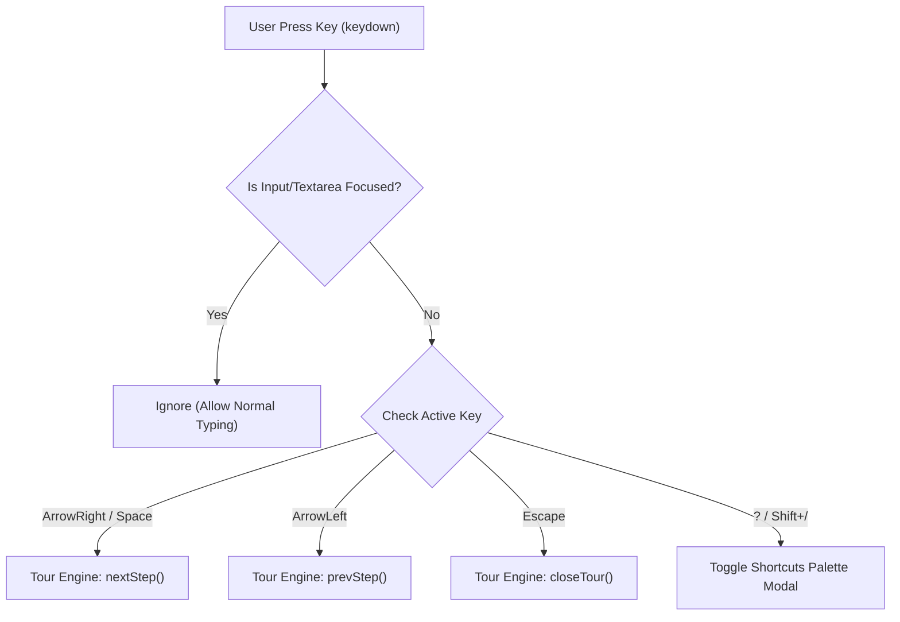

# Technical Specification: Keyboard Navigation, Shortcuts Palette & Accessibility (a11y)

## 📌 Feature Overview
This document specifies the technical design and implementation blueprint for **Global Keyboard Navigation**, **Shortcuts Palette Modal**, and **Accessibility (a11y) Focus Trapping** within the `laravel-onboarding-tour` package.

---

## 🚀 Key Requirements & Goals
1. **Seamless Keyboard Navigation**: Allow users to navigate through guided tours using natural hotkeys (`Arrow Right`, `Arrow Left`, `Space`, `Enter`, `ESC`).
2. **Interactive Shortcuts Palette Modal**: A dedicated modal displaying available hotkeys with styled `<kbd>` keys, accessible at any time by pressing `?` (or `Shift + /`) or by clicking a `Shortcuts` button in the popover footer.
3. **Accessibility (a11y) Compliance**: Full ARIA roles (`role="dialog"`, `aria-modal="true"`, `aria-live="polite"`), focus trapping within active popovers/modals, and screen-reader friendliness.

---

## ⌨️ Keyboard Shortcuts Mapping

| Hotkey | Action | Scope | Description |
| :--- | :--- | :--- | :--- |
| `→` / `L` | **Next Step** | Active Tour | Advances to the next step in the tour |
| `←` / `H` | **Previous Step** | Active Tour | Returns to the previous step in the tour |
| `Space` / `Enter` | **Primary Action** | Active Tour | Triggers the default action (Next or Finish) |
| `ESC` | **Dismiss Tour** | Active Tour / Modal | Closes/dismisses the active tour or modal |
| `?` / `Shift + /` | **Toggle Shortcuts Palette** | Active Tour / Builder | Opens/closes the interactive Keyboard Shortcuts Palette |

---

## 🎨 Interactive Shortcuts Palette Modal (`#tour-shortcuts-modal`)

The **Shortcuts Palette Modal** is a floating glassmorphism modal that lists all hotkeys with crisp visual badges.

### UI Mockup & Design
```
┌─────────────────────────────────────────────────────────────┐
│  ⌨️ Keyboard Shortcuts                                   ✕  │
├─────────────────────────────────────────────────────────────┤
│  Next Step                 [ → ]  or  [ Space ]             │
│  Previous Step             [ ← ]                            │
│  Finish / Complete         [ Enter ]                        │
│  Dismiss / Close           [ ESC ]                          │
│  Show / Hide Shortcuts     [ ? ]                            │
├─────────────────────────────────────────────────────────────┤
│                             [ Close ]                       │
└─────────────────────────────────────────────────────────────┘
```

---

## 🏗️ Technical Architecture & Implementation Details



---

## 💻 Code Specifications

### 1. JavaScript Keyboard Listener & Shortcuts Modal (`resources/js/tour-engine.js`)

```javascript
// Add to Tour Engine Singleton
const ShortcutsModule = {
    isOpen: false,

    bindGlobalKeydown: function () {
        document.addEventListener('keydown', (e) => {
            // Ignore hotkeys when typing inside inputs, textareas, or contenteditable elements
            const activeTag = document.activeElement ? document.activeElement.tagName.toLowerCase() : '';
            if (activeTag === 'input' || activeTag === 'textarea' || document.activeElement.isContentEditable) {
                return;
            }

            // 1. Toggle Shortcuts Palette Modal (`?` or `Shift + /`)
            if (e.key === '?' || (e.shiftKey && e.code === 'Slash')) {
                e.preventDefault();
                this.toggleShortcutsModal();
                return;
            }

            // 2. ESC Key: Close Palette Modal or Dismiss Tour
            if (e.key === 'Escape') {
                if (this.isOpen) {
                    this.toggleShortcutsModal(false);
                    return;
                }
                if (window.LaravelOnboardingTour.isTourActive()) {
                    window.LaravelOnboardingTour.closeTour(true);
                    return;
                }
            }

            // 3. Tour Navigation Hotkeys (Only active when tour is running)
            if (window.LaravelOnboardingTour.isTourActive()) {
                if (e.key === 'ArrowRight' || e.key === 'l' || e.key === 'L') {
                    e.preventDefault();
                    window.LaravelOnboardingTour.nextStep();
                } else if (e.key === 'ArrowLeft' || e.key === 'h' || e.key === 'H') {
                    e.preventDefault();
                    window.LaravelOnboardingTour.prevStep();
                } else if (e.key === 'Enter' || e.key === ' ') {
                    e.preventDefault();
                    window.LaravelOnboardingTour.nextStep();
                }
            }
        });
    },

    toggleShortcutsModal: function (forceState) {
        this.isOpen = forceState !== undefined ? forceState : !this.isOpen;
        let modal = document.getElementById('tour-shortcuts-modal');

        if (!this.isOpen) {
            if (modal) modal.remove();
            return;
        }

        if (!modal) {
            modal = document.createElement('div');
            modal.id = 'tour-shortcuts-modal';
            modal.className = 'tour-shortcuts-modal';
            modal.setAttribute('role', 'dialog');
            modal.setAttribute('aria-modal', 'true');
            modal.setAttribute('aria-label', t('shortcuts_title', 'Keyboard Shortcuts'));
            
            modal.innerHTML = `
                <div class="tour-modal-card tour-shortcuts-card animate-scale-in">
                    <div class="flex items-center justify-between pb-3 border-b border-zinc-200 dark:border-zinc-700 mb-4">
                        <div class="flex items-center gap-2">
                            <span class="text-blue-500">${SVG.keyboard || '⌨️'}</span>
                            <h3 class="text-sm font-bold">${t('shortcuts_title', 'Keyboard Shortcuts')}</h3>
                        </div>
                        <button id="tour-shortcuts-close-btn" class="tour-btn-icon" aria-label="${t('close', 'Close')}">
                            ${SVG.close}
                        </button>
                    </div>

                    <div class="space-y-2.5 mb-6 text-xs">
                        <div class="flex items-center justify-between py-1">
                            <span class="text-zinc-600 dark:text-zinc-300 font-medium">${t('shortcut_next', 'Next Step')}</span>
                            <div class="flex items-center gap-1">
                                <kbd class="tour-kbd">→</kbd>
                                <span class="text-zinc-400 text-[10px]">${t('or', 'or')}</span>
                                <kbd class="tour-kbd">Space</kbd>
                            </div>
                        </div>
                        <div class="flex items-center justify-between py-1">
                            <span class="text-zinc-600 dark:text-zinc-300 font-medium">${t('shortcut_prev', 'Previous Step')}</span>
                            <kbd class="tour-kbd">←</kbd>
                        </div>
                        <div class="flex items-center justify-between py-1">
                            <span class="text-zinc-600 dark:text-zinc-300 font-medium">${t('shortcut_finish', 'Finish Tour')}</span>
                            <kbd class="tour-kbd">Enter</kbd>
                        </div>
                        <div class="flex items-center justify-between py-1">
                            <span class="text-zinc-600 dark:text-zinc-300 font-medium">${t('shortcut_close', 'Dismiss / Exit')}</span>
                            <kbd class="tour-kbd">ESC</kbd>
                        </div>
                        <div class="flex items-center justify-between py-1">
                            <span class="text-zinc-600 dark:text-zinc-300 font-medium">${t('shortcut_toggle', 'Toggle Shortcuts')}</span>
                            <kbd class="tour-kbd">?</kbd>
                        </div>
                    </div>

                    <div class="flex justify-end pt-2 border-t border-zinc-100 dark:border-zinc-800">
                        <button id="tour-shortcuts-ok-btn" class="tour-btn tour-btn-accent text-xs px-4 py-1.5">${t('close', 'Close')}</button>
                    </div>
                </div>
            `;
            document.body.appendChild(modal);

            document.getElementById('tour-shortcuts-close-btn').onclick = () => this.toggleShortcutsModal(false);
            document.getElementById('tour-shortcuts-ok-btn').onclick = () => this.toggleShortcutsModal(false);
        }
    }
};
```

---

### 2. Styles for Keyboard Badges & Shortcuts Modal (`resources/css/tour-styles.css`)

```css
/* Shortcuts Palette Modal Overlay */
#tour-shortcuts-modal,
.tour-shortcuts-modal {
    position: fixed !important;
    inset: 0 !important;
    z-index: 100040 !important;
    display: flex !important;
    align-items: center !important;
    justify-content: center !important;
    padding: 16px;
    background-color: rgba(0, 0, 0, 0.6) !important;
    backdrop-filter: blur(6px) !important;
    -webkit-backdrop-filter: blur(6px) !important;
}

/* Styled KBD Key Badges */
.tour-kbd {
    display: inline-flex;
    align-items: center;
    justify-content: center;
    min-width: 24px;
    height: 24px;
    padding: 0 6px;
    font-family: ui-monospace, SFMono-Regular, Menlo, Monaco, Consolas, monospace;
    font-size: 11px;
    font-weight: 700;
    line-height: 1;
    color: var(--tour-text-main);
    background: var(--tour-bg-elevated);
    border: 1px solid var(--tour-border-color);
    border-bottom-width: 2px;
    border-radius: 6px;
    box-shadow: 0 1px 2px rgba(0, 0, 0, 0.1);
}
```

---

## ♿ Accessibility (a11y) Best Practices
- **Focus Trap**: Keep keyboard focus inside `#tour-popover-card` or `#tour-shortcuts-modal` while active.
- **Screen Reader Announcements**: Use `aria-live="polite"` on popover steps so screen readers automatically announce: `"Step 2 of 5: Filter Bar - Use filters to refine search"`.
- **High Contrast Focus Rings**: Ensure all focused `<kbd>` and action buttons have high contrast outlines.
